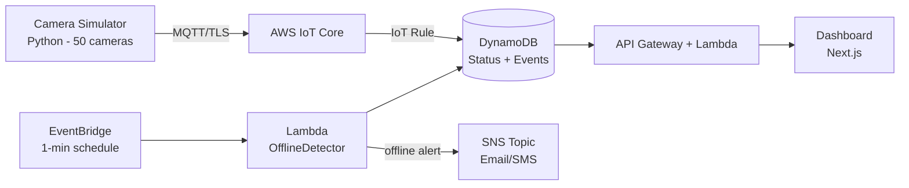

# Camera Fleet Monitor

A cloud-native monitoring system for IP camera fleets — built on AWS to detect, alert, and visualize camera health in real time.

> Built by someone who spent over a decade maintaining physical camera fleets in the field. This is the monitoring system I wish I'd had.

---

## The Problem

In physical security, the most expensive failure is silent: **nobody knows a camera is down until the footage is needed.** A camera can be offline for days — and you only find out when an incident happens and there's no recording.

This project solves that with a cloud platform that continuously monitors a fleet of IP cameras, detects failures within minutes, and alerts operators automatically.

---

## Architecture

A fleet of simulated IP cameras publishes heartbeats over **MQTT/TLS** to **AWS IoT Core**. An IoT Rule routes telemetry to **DynamoDB**. A scheduled **Lambda** detects cameras that stopped reporting and fires alerts via **SNS**. A REST API serves fleet status to a **dashboard**.

---

## Tech Stack

- **Telemetry:** AWS IoT Core (MQTT over TLS, per-device X.509 certificates)
- **Storage:** DynamoDB (camera status + event history with TTL)
- **Compute:** AWS Lambda (offline detection, metrics, REST API)
- **Alerting:** Amazon SNS (email/SMS)
- **API:** API Gateway + Lambda
- **Dashboard:** Next.js
- **Infrastructure as Code:** Terraform (100% of the stack)
- **CI/CD:** GitHub Actions
- **Language:** Python (simulator + Lambdas)

---

## Security by Design

- **Per-device identity:** each camera authenticates with a unique X.509 certificate; IoT policies scope each device to its own topic (prevents lateral movement at the device layer).
- **Least-privilege IAM:** every Lambda runs with a role scoped to the exact tables and actions it needs.
- **No public database:** DynamoDB is reachable only through Lambda; the dashboard only through the API.
- **Zero hardcoded secrets:** credentials and certificates are never committed to the repository.
- **Audit trail:** camera state changes are recorded as an immutable event log.

---

## Project Status

🚧 **In active development.** Built in phases, each independently demonstrable.

- [x] Phase 0 — Repository & architecture
- [ ] Phase 1 — Telemetry flowing (simulator → IoT Core → DynamoDB)
- [ ] Phase 2 — Failure detection & alerts
- [ ] Phase 3 — REST API
- [ ] Phase 4 — Dashboard
- [ ] Phase 5 — Polish & documentation

---

## Cost

Designed to run within AWS free tier (~$1–3/month after). Cost-aware decisions documented throughout — e.g., heartbeat intervals tuned to stay within IoT Core's message limits.

---

## Author

**Paulo Biao** — Security Systems Specialist transitioning to Cloud & Cybersecurity.
[biaotech.dev](https://biaotech.dev)